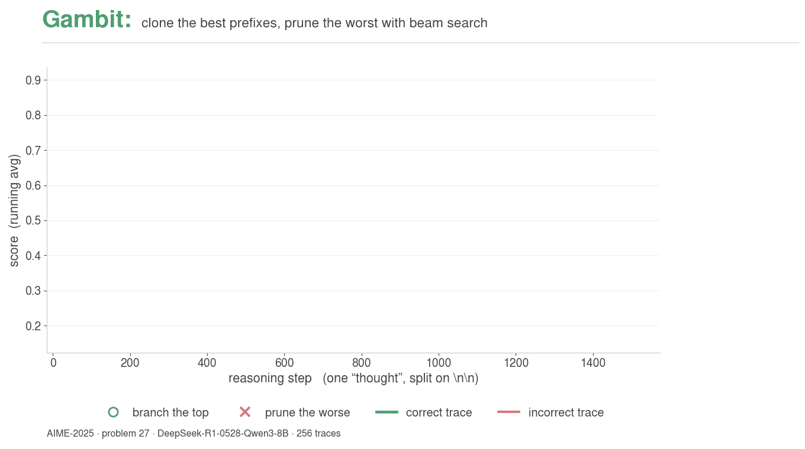

# Gambit: Thought-Level Beam Search for Reasoning [COLM 2026]

[](https://arxiv.org/abs/2608.08020)

Official implementation of [**Thought-Level Beam Search for Reasoning**](https://arxiv.org/abs/2608.08020).

<p align="center">
  
</p>

Gambit is an adaptive parallel-reasoning framework built on top of **vLLM v0.11.1**.
Instead of sampling many independent reasoning traces and voting, Gambit runs a
**score-guided tournament beam search** over reasoning *thoughts*: it continuously
reallocates the compute budget toward the most promising reasoning prefixes while
generation is still in flight.

The quality signal is a lightweight **hidden-state step scorer** — a small MLP that
reads a trace's hidden state at reasoning-step boundaries and predicts trace-level
correctness — used as a *guide* for the beam search rather than a filter.

## How Gambit works

Gambit maintains a fixed capacity `C` of active traces and, at regular intervals
(after a warm-up), runs a rank-based tournament:

1. **Hard floor** — kill any trace whose average score falls below an absolute floor.
2. **Under capacity** — branch the best available traces to fill empty slots.
3. **At capacity** — **swap**: prune the bottom-`K` lowest-scoring traces and branch
   the top-`K` highest-scoring traces.

Branching replays a parent's token sequence as the child's prompt, so the child
inherits the parent's KV cache via vLLM prefix caching. The final answer is a
score-weighted majority vote over completed traces.

This turns score-based *pruning* into score-guided *beam search* — a dynamic beam
search steered by a learned value signal instead of fixed thresholds.

### Paper terminology in the code

The paper's terms map onto the implementation as follows:

| Paper | Code |
|---|---|
| thought (reasoning step) | a `"\n\n"` boundary in the generated text; the scorer fires there |
| beam / active pool | the active traces in [`TraceTree`](vllm/v1/engine/trace_tree.py) |
| capacity `C` | `tournament_capacity` |
| swap size `K` | `tournament_swap_k` |
| check interval `Δ` | `tournament_check_interval` |
| warmup `w` | `tournament_warmup_tokens` |
| hard floor `δ` | `tournament_hard_floor` |
| scheduler view / tree view (§4.2) | the vLLM scheduler's running set vs. `TraceTree`; evicted "ghost" traces stay active in the tree |

| | Threshold pruning | Gambit |
|---|---|---|
| Decision rule | prune if score < θ | tournament: swap bottom-K for top-K |
| Role of the score | filter (discard bad) | guide (amplify good) |
| Capacity control | implicit | explicit fixed capacity `C` |
| Compute allocation | static | dynamically reallocated to top traces |

## Install

Gambit is built on vLLM v0.11.1 and compiles the vLLM C++/CUDA extensions.

> ⚠️ Compiling vLLM can take a long time (sometimes several hours) depending on
> your GPU architecture, CUDA version, and compiler. Please plan accordingly.

```bash
# Pull in the correct PyTorch / CUDA dependencies via the official vLLM wheel.
uv pip install vllm --torch-backend=auto
# Install this repository in editable mode.
pip install -e . --no-build-isolation
# Extra dependencies for the evaluation and scorer-training scripts.
pip install -r gambit/requirements.txt
```

See the [vLLM v0.11.1 docs](https://docs.vllm.ai/en/v0.11.1/) for platform details.

## Code structure

Gambit is implemented on the vLLM v1 engine. Key files:

- **Config** — [`vllm/config/gambit.py`](vllm/config/gambit.py): `GambitConfig` holds
  all parameters (scorer path, tournament capacity/swap-K/interval/warm-up/hard-floor).
  Passed to `LLM(...)` via `gambit_*` keyword arguments.
- **Tournament / beam search** — [`vllm/v1/engine/core.py`](vllm/v1/engine/core.py):
  rank-based prune-and-branch logic and score bookkeeping.
- **Trace tree** — [`vllm/v1/engine/trace_tree.py`](vllm/v1/engine/trace_tree.py):
  parent/child relationships, score histories, completion status.
- **Hidden-state capture + scoring** —
  [`vllm/v1/worker/gpu_model_runner.py`](vllm/v1/worker/gpu_model_runner.py) and the
  scorers in [`vllm/v1/hiddenstate/classifier.py`](vllm/v1/hiddenstate/classifier.py)
  (`HiddenstateClassifier` MLP and `SequenceScorer` transformer).
- **Memory-aware scheduling** —
  [`vllm/v1/core/sched/scheduler.py`](vllm/v1/core/sched/scheduler.py): the
  `SchedulingPolicy.GAMBIT` policy prunes when the KV cache nears saturation.

## Quick start

```python
from transformers import AutoTokenizer
from vllm import LLM, SamplingParams

model = "deepseek-ai/DeepSeek-R1-0528-Qwen3-8B"
scorer = "gambit/step_scorer_checkpoint/DeepSeek-R1-0528-Qwen3-8B_step_scorer.pt"

# Use the same chat template and system prompt as the evaluation harness;
# feeding a raw question string gives materially worse results.
tokenizer = AutoTokenizer.from_pretrained(model)
prompt = tokenizer.apply_chat_template(
    [
        {"role": "system",
         "content": "Please reason step by step, and put your final answer within \\boxed{}"},
        {"role": "user", "content": "What is the value of 1 + 1?"},
    ],
    tokenize=False,
    add_generation_prompt=True,
)

sampling_params = SamplingParams(
    n=256, temperature=0.6, top_p=0.95, top_k=20, max_tokens=60000,
)
llm = LLM(
    model=model,
    tensor_parallel_size=1,
    gpu_memory_utilization=0.9,
    gambit_enable=True,
    gambit_step_scorer_path=scorer,
    gambit_enable_branching=True,
    gambit_tournament_mode=True,
    gambit_tournament_capacity=256,
    gambit_tournament_swap_k=16,
    gambit_tournament_check_interval=200,
    gambit_tournament_warmup_tokens=12000,
    gambit_tournament_hard_floor=0.1,
    # Stop once C traces have completed (the paper's |F| < C termination).
    # Defaults to 0 = disabled, so set it explicitly.
    gambit_stop_after_completed_traces=256,
    disable_log_stats=False,
)

# Branched traces are engine-internal: they do NOT appear in
# RequestOutput.outputs, which contains only the surviving root traces.
# To see every trace the search produced, read the trace tree.
llm.reset_gambit_state()          # clear tree state from the previous prompt
outputs = llm.generate([prompt], sampling_params)
tree = llm.get_gambit_tree_export()
for req_id, node in tree["nodes"].items():
    if node["is_completed"]:
        ...  # node["output_token_ids"], node["final_score"], node["parent_id"]
```

> **Important.** Call `reset_gambit_state()` before each prompt and collect
> results from `get_gambit_tree_export()`. Reading only `RequestOutput.outputs`
> silently discards every branched trace, which is most of the search.

Step-scorer checkpoints for DeepSeek-R1-0528-Qwen3-8B, Qwen3-4B, and
Phi-4-reasoning-plus are provided under
[`gambit/step_scorer_checkpoint`](gambit/step_scorer_checkpoint) and can be used
directly. To train the history-aware sequence scorer instead, see
[`gambit/train_scorer`](gambit/train_scorer).

## Evaluation

Use [`gambit/tests/benchmark_eval.py`](gambit/tests/benchmark_eval.py) to evaluate
AIME-25, HMMT-24, HMMT-25, and GPQA-Diamond. Every problem in the benchmark file is
run by default; pass `--problem-indices` to restrict to a subset.

> **Note.** The paper additionally reports AIME 2026. That benchmark file is not
> redistributed here; point `--benchmark` at your own JSONL with `question` and
> `answer` fields to reproduce it.

The tournament hyperparameters below are the paper's (Section 5.1) and are the
defaults in both `benchmark_eval.py` and `GambitConfig`. Example — reproduce
DeepSeek-R1-0528-Qwen3-8B on AIME-25 with the Gambit tournament:

```bash
python gambit/tests/benchmark_eval.py \
  --benchmark gambit/datasets/aime_2025.jsonl \
  --output-dir gambit/eval_result \
  --model-path deepseek-ai/DeepSeek-R1-0528-Qwen3-8B \
  --gambit-step-scorer-path gambit/step_scorer_checkpoint/DeepSeek-R1-0528-Qwen3-8B_step_scorer.pt \
  --num-traces 256 --gpu-memory-utilization 0.9 \
  --enable-gambit --enable-branching \
  --tournament-capacity 256 --tournament-swap-k 16 \
  --tournament-check-interval 200 --tournament-warmup-tokens 12000 \
  --tournament-hard-floor 0.1 --stop-after-completed-traces 256
```

Sampling uses `temperature=0.6, top_p=0.95, top_k=20` (`temperature=0.8, top_k=50`
for Phi-4-reasoning-plus, per that model's card), `max_tokens=60000`, clamped to
32000 for Phi-4-reasoning-plus, whose context window is 32K.

To sweep all four benchmarks across GPUs, use
[`scripts/run_benchmarks.sh`](scripts/run_benchmarks.sh), which wraps the same
command:

```bash
MODEL=deepseek-ai/DeepSeek-R1-0528-Qwen3-8B GPUS="0 1 2 3" SEED=42 \
  bash scripts/run_benchmarks.sh
```

It launches one benchmark per GPU, so keep `GPUS` at least as long as the
benchmark list or the jobs will contend for memory. It also passes
`--no-score-history`, which suppresses per-step score trajectories in the saved
output to keep memory bounded; drop it if you want to inspect them.

Compute pass@k over saved runs with
[`gambit/tests/compute_pass_at_n.py`](gambit/tests/compute_pass_at_n.py). To
average over repeats, re-run with a different `SEED` and pool the run
directories: `--run-dir RUN_A --run-dir RUN_B`.

## Acknowledgements

We are grateful for the compute resources provided by [Dao AI Lab](https://dao-lab.ai/)
and the Princeton Language Institute (PLI).

We adapt code and scripts from
[STEP](https://github.com/Supercomputing-System-AI-Lab/STEP),
[DeepConf](https://github.com/facebookresearch/deepconf), and the
[vLLM](https://github.com/vllm-project/vllm) serving engine.

## Citation

If you find this work useful, please cite our paper:

```bibtex
@misc{yang2026thoughtlevelbeamsearch,
  title         = {Thought-Level Beam Search for Reasoning},
  author        = {Lijie Yang and Hongyin Luo and Jiawei Zhao and Tri Dao and Ravi Netravali},
  year          = {2026},
  eprint        = {2608.08020},
  archivePrefix = {arXiv},
  primaryClass  = {cs.AI},
  url           = {https://arxiv.org/abs/2608.08020},
}
```
